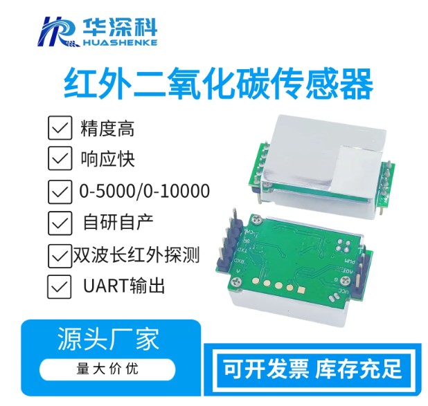

**Language:** [English](README.md) | [中文](README.zh-CN.md)

# Huashenke HH-X8C-10000 · NDIR CO₂ Sensor Driver

**Vendor:** Henan Huashenke Intelligent Technology Co., Ltd  
**Model:** HH-X8C-10000  
**Type:** NDIR infrared CO₂, UART **query** protocol  

Platform-independent C driver for the Huashenke **HH-X8C-10000** NDIR CO₂ sensor.



*HH-X8C-10000 NDIR CO₂ sensor · Henan Huashenke Intelligent Technology*

---

## Features

- Platform-independent: `sensor_io_t` injects `read` / `write` / `now_ms` (**`write` required** for query mode)
- Query-style: each `get()` talks to the module for you — no manual command framing
- Range 400–10000 ppm, `float co2_ppm`
- 3-minute warm-up checked **after** a good parse (`HHX8C_ERR_WARMUP`)
- Return codes: `0` OK, `1` param/write/no-reply, `2` warming up
- **Reads concentration only** — never sends zero / SPAN calibration

## IO interface you must implement

The driver never touches the HAL. It only uses three function pointers you inject at `init` (see `src/sensor.h`):

```c
typedef struct sensor_io {
    /* Read UART: non-blocking; return bytes actually read; 0 = no data now */
    uint32_t (*read)(uint8_t *buf, uint32_t len);

    /* Write UART: REQUIRED for this query sensor.
     * Non-blocking; return bytes actually written;
     * if you return < len the driver treats it as failure
     * (or loop until fully written, then return len). */
    uint32_t (*write)(const uint8_t *buf, uint32_t len);

    /* Millisecond tick: required; timeout & warm-up */
    uint32_t (*now_ms)(void);
} sensor_io_t;
```

Rules:

1. **`read` / `write` must be non-blocking** — no `delay` or wait-for-TX-complete inside; return 0 when empty, the driver retries until its deadline.
2. **`write` is mandatory**: every `get()` first sends a read command; a failed write returns `HHX8C_ERR_IO`.
3. **`now_ms` returns ms since boot** (wrap-around OK); warm-up and `wait_ms` use it.
4. On a shared UART, **flushing RX after channel switch is the caller’s job** (flush before `get`).

The driver stays platform-independent: supply `io` at init; no MCU/RTOS assumptions.

## Usage

```c
#include "sensor_hhx8c.h"

sensor_hhx8c_t ctx;
sensor_hhx8c_data_t data = {0};

sensor_hhx8c_init(&ctx, &io);           /* io.write required */

uint32_t err = sensor_hhx8c_get(&ctx, &data, HHX8C_WAIT_MS_TYPICAL);
if (err == HHX8C_OK) {
    /* data.co2_ppm */
} else if (err == HHX8C_ERR_WARMUP) {
    /* link OK, still within 3-minute warm-up */
} else {
    /* write fail / timeout / checksum / bad args */
}
```

Build: add `src/*.c` and put `src/` on the include path.

## Layout

| Path | Description |
|------|-------------|
| `src/sensor.h` | Dependency-injection (IO API) |
| `src/sensor_hhx8c.h/.c` | Driver |
| `img/` | Product photos |
| `docs/HH-X8C-10000二氧化碳说明书.docx` | Vendor datasheet (Chinese) |

---

**License:** MIT  
**Datasheet:** see `docs/`
